# VMRay Report Phishing Outlook Add-in Deployment Guide

This repository contains the necessary components and instructions to deploy the VMRay Report Phishing Add-in for Outlook. This tool allows users to report suspicious emails directly to a VMRay Incident Response (IR) mailbox for automated  analysis.

---

## Introduction

### Microsoft Outlook Add-ins

Microsoft Outlook Add-ins are web-based extensions that integrate directly into Microsoft Outlook (Desktop, Web, and Mobile). They allow organizations to extend Outlook’s functionality by embedding custom workflows directly inside the mailbox experience.

Using Microsoft 365 Single Sign-On (SSO) and Microsoft Graph API, add-ins can securely interact with user mailbox data without storing credentials, while maintaining enterprise-grade security and compliance.


### About VMRay

VMRay is a leading provider of automated malware analysis and advanced threat detection solutions. Using hypervisor-based sandboxing technology, VMRay delivers deep visibility into sophisticated and evasive cyber threats. 

The **VMRay Report Phishing Outlook Add-in** enables users to:

-   Report suspicious emails with a single click
-   Securely forward the original email (including attachments) to a designated VMRay Incident Response (IR) mailbox
-   Automatically move reported emails to a dedicated Outlook folder
-   Authenticate seamlessly using Microsoft 365 SSO

This add-in streamlines phishing reporting workflows while maintaining security, transparency, and user simplicity.

---


## Prerequisites

* **Microsoft 365 Administrator Account (with Exchange Online):** Required to configure Azure, register the application, grant permissions, and deploy the Outlook add-in within your organization.
* **Azure Subscription:** Required to create the Azure App Registration and host the Azure Web App (middle-tier API).
* **Visual Studio Code with Azure Extensions (Azure Account & Azure App Service):** Required to sign in to Azure and deploy the middle-tier web application.
* **VMRay IR Mailbox:** A designated email address that will receive reported phishing emails for automated analysis.

---
## Installation Steps

### Phase 1 – Sign in to Azure (VS Code)

1. Open your Outlook Add-in project in **Visual Studio Code**.
2. Select the **Azure** icon in the Activity Bar (left sidebar).
   * If the Activity Bar is hidden, enable it via:
     **View → Appearance → Activity Bar**
3. In the **App Service** explorer panel, select: **Sign in to Azure…**

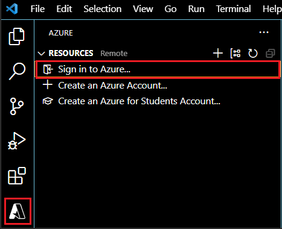

4. Follow the authentication prompts in your browser and sign in with your **Microsoft 365 Administrator account**.

* Once signed in successfully, your Azure subscriptions will appear in the App Service explorer.

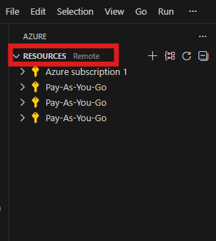

---


### Phase 2 – Create Azure Web App (Linux – Node 22 LTS)

1. In VS Code, expand your **Azure subscription** under **App Services**.

2. Right-click **App Services** → select
   **Create New Web App… (Advanced)** and fill the details.

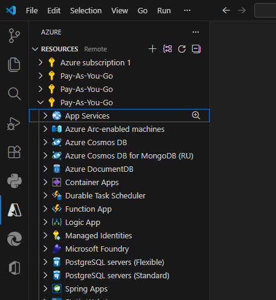

3. **Location**: Select the Azure region **nearest to your users**.
4. **Hostname Type**: Select  **Global default hostname**
5. For **Resource Group**: Select **Create new resource group** and enter: ` VMRay-Outlook-Addin`
6. **Web App Name**: Enter a globally unique name:  `outlook-addin-vmray`
7. **Runtime Stack**: Select **Node 22 LTS**
8. **Operating System**: Select **Linux**
9. **Pricing Tier (Production Recommendation)**: For production deployment, select:  **Basic (B1)**
10. **Application Insights**: Select **Skip for now**

The Web App will now be provisioned.

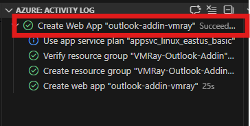


11. Once the Web App is created Successfully:
    * Right-click on your new App Service Web App → select **Open in Portal**.

    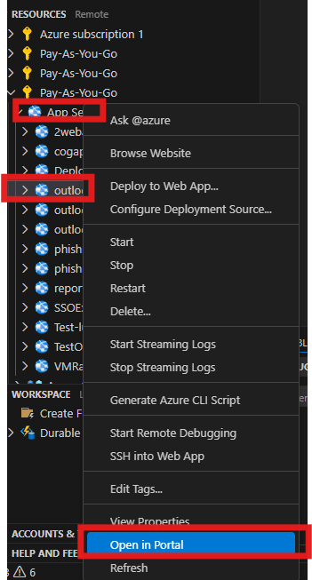

    * In the Azure Portal → **Overview pane**, copy the domain name: `outlook-web-app.azurewebsites.net`

    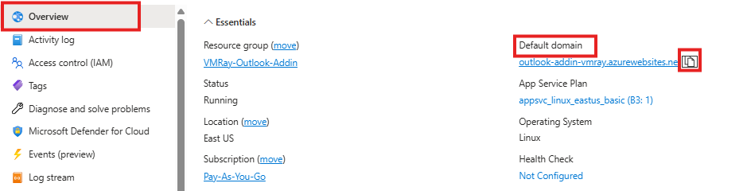

    * Save this domain value for later.

---


## Phase 3 – Manual Azure App Registration (SSO Configuration)

### Step 1 – Create App Registration

1. Go to **Azure Portal** [https://portal.azure.com](https://portal.azure.com)
2. Navigate to: **App registrations**

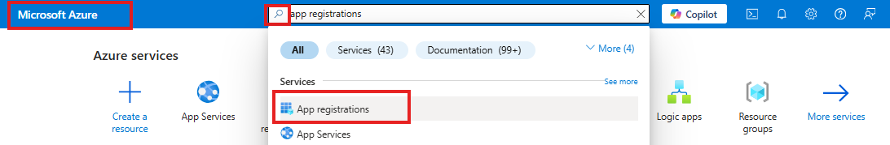

3. Click **New registration**

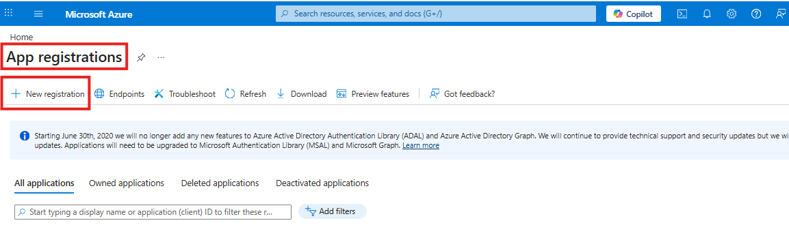

4. Fill:
    * **Name:** ` VMRay-Outlook-Addin-App`
    * **Supported account types:**  Accounts in this organizational directory only
    * **Redirect URI:** Leave blank for now.
5. Click **Register**


### Step 2 – Copy Required Values

1. From **Overview**, copy:
    * **Application (client) ID**
    * **Directory (tenant) ID**

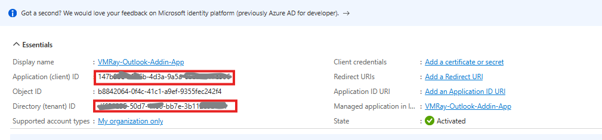

2. Save these values.

---

### Step 3 – Create Client Secret

1. Navigate to:**Manage → Certificates & secrets**


2. Click: **+ New client secret**
3. Fill:
    * **Description:** `VMRay-Production-Secret`
    * **Expires:** 24 months (recommended for production)
4. Click **Add**
5. Immediately copy the **Value** of the secret.

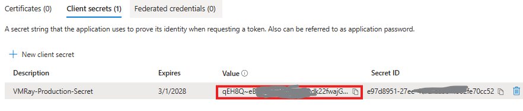

⚠ Important: You will not be able to view Client Secret after sometime. Save it securely. This will be used in Azure Web App environment variables.

---

## Step 4 – Configure Authentication

1. Navigate to: **Manage → Authentication**
2. Click: **+ Add Redirect URI → Single Page Application**

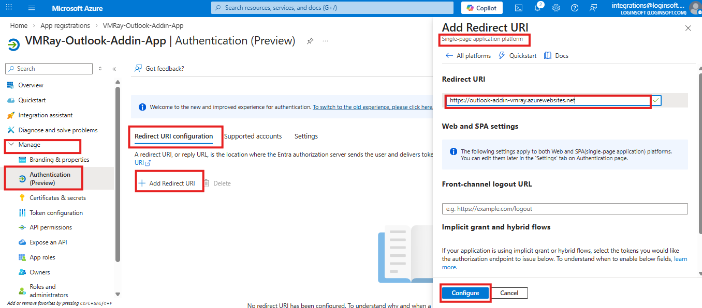

3. Select:  **Single-page application**
4. Add Redirect URI:
```
https://YOUR-WEB-APP-DOMAIN
```
5. Click **Configure** and **Close**
6. Now again click on Edit and Add below Redirect URI also
```
https://YOUR-WEB-APP-DOMAIN/fallbackauthdialog.html
```
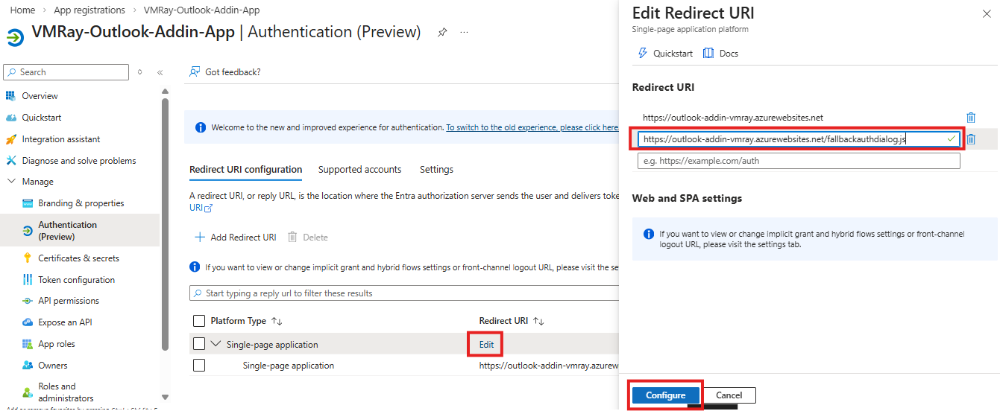

7. Copy and Save above fallback redirect Uri.

---

## Step 5 – Expose an API

1. Navigate to: **Manage → Expose an API**

2. Click **Set** (next to Application ID URI)

* Edit manually and add domain (Without https) after `api://` like below:

```
api://YOUR-DOMAIN.azurewebsites.net/CLIENT_ID
```

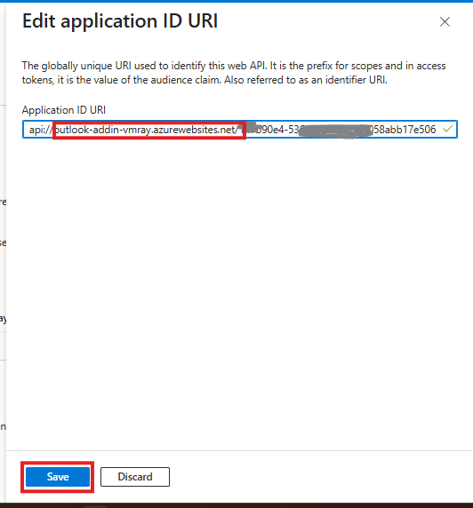

3. Click **Save**

4. Copy `Application ID URI` value and save it for later.


### Add Scope

1. Click **+ Add a scope**

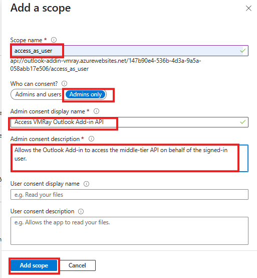

2. Fill:
    * **Scope name:** `access_as_user`
    * **Who can consent:** Admins Only
    * **Admin consent display name:** `Access VMRay Outlook Add-in API`
    * **Admin consent description:** `Allows the Outlook Add-in to access the middle-tier API on behalf of the signed-in user.`
    * **State:** `Enabled`

3. Copy the entire `Scope` value like below **Scope name:** and save it. We need it later.
   ```
   api://{WEB_APP_DOMAIN}/{CLIENT_ID}/access_as_user
   ```

4. Click **Add scope**

---

### Pre-authorize Microsoft Office Client Applications

After creating the scope, you must pre-authorize Microsoft Office as a client application.

1. Scroll down to **Authorized client applications**
2. Click:  **+ Add a client application**


4. In **Client ID**, enter:

   ```
   ea5a67f6-b6f3-4338-b240-c655ddc3cc8e
   ```

   This value pre-authorizes all Microsoft Office application endpoints.

5. Under **Authorized scopes**, enable checkbox:
   ```
   access_as_user
   ```
6. Click **Add application**

---

## Step 6 – Configure API Permissions

1. Navigate to: **Manage → API permissions**


2. Click **+ Add a permission**
3. Select: **Microsoft Graph**  → **Delegated permissions**. Search for below permissions and enable them

* `Mail.Send`
* `Mail.ReadWrite`
* `User.Read`
* `openid`


Click **Add permissions**

5. Click:   **Grant admin consent for <Your Tenant Name>** and then Confirm.


---


## Phase 4 – Configure Azure Web App Environment Variables

After completing App Registration, configure your web app with the required values.

### Step 1 – Add Application Settings

1. Go to: **Azure Portal → App Services → Your Web App**
2. Navigate to: **Settings → Environment variables**
3. Under **Application settings**, click:  **+ Add**

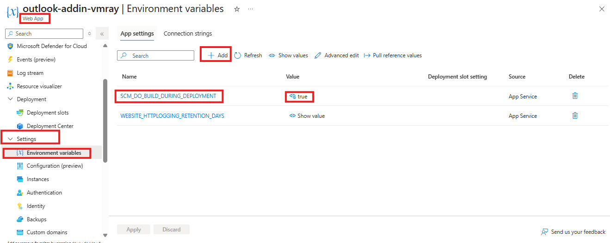

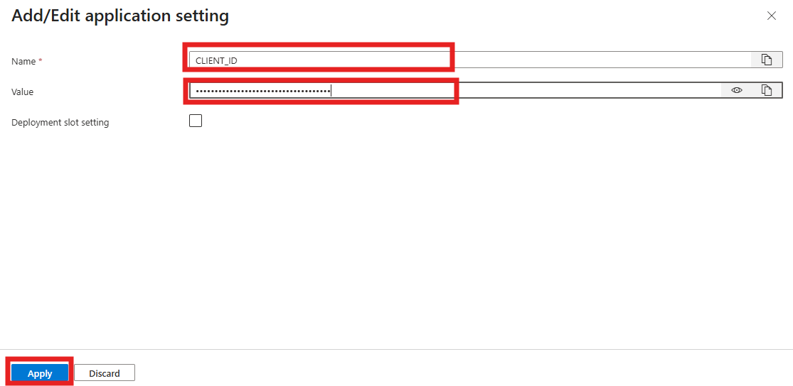

4. Add the following **Application settings**:

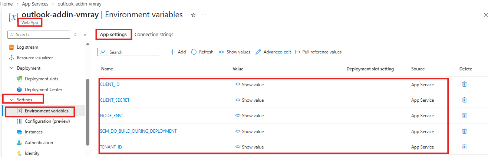

| Name            | Value                            | Description                                       |
| --------------- | -------------------------------- | ------------------------------------------------- |
| `CLIENT_ID`     | Your **Application (client) ID** | Identifies your Azure App Registration            |
| `TENANT_ID`     | Your **Directory (tenant) ID**   | Identifies your Microsoft 365 tenant              |
| `CLIENT_SECRET` | Your **Client Secret (Value)**   |  ⚠ Use the **Secret Value**, not the Secret ID. Used by the backend to authenticate with Azure AD.|
| `NODE_ENV` | production   |  It is industry standard for Node apps.|

* Also make sure that environment variable `SCM_DO_BUILD_DURING_DEPLOYMENT` is set to true

4. Click **Apply**
5. Click **Confirm**
6. Restart the Web App when prompted.

### Step 2 – Set the Web App to Always On

1. Navigate to:
   **Settings → Configuration(Preview) → General Settings **
2. Enable `Always On`

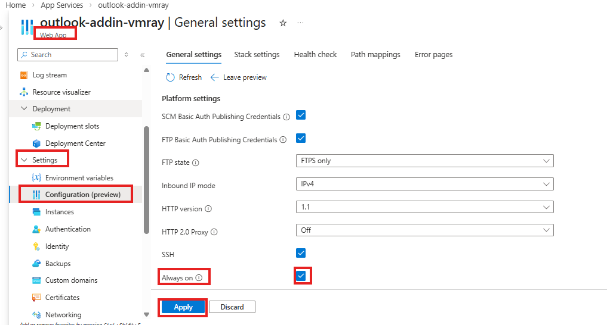

3. Click **Apply**

---
# Phase 5 – Update Project Configuration for Production

### Step 1 – Update `webpack.config.js`

* Open `webpack.config.js` im your project root folder
and update domain constants:

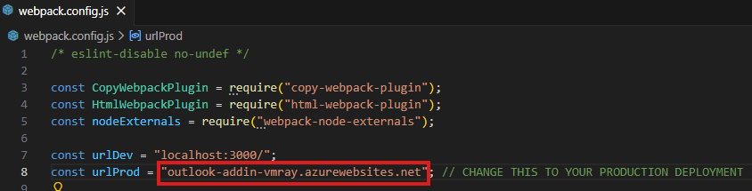

```js
const urlProd = "yourdomain.azurewebsites.net";
```
⚠ Do NOT include `https://`

### Step 2 – Update `manifest.xml`

* Open `manifest.xml` file and update all the highlighted domain values below with your Web App domain.


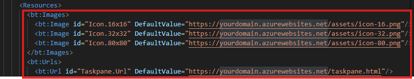

* #### For Example Replace below 

    ```xml
    <IconUrl DefaultValue="https://yourdomain.azurewebsites.net/assets/icon-128.png"/>
    ```
* #### With Replace AppDomain
```xml
    <IconUrl DefaultValue="https://outlook-web-app.azurewebsites.net/assets/icon-128.png"/>
```
* #### Next update `WebApplicationInfo` section with 
    `Client_Id` and `Application ID URI`  value

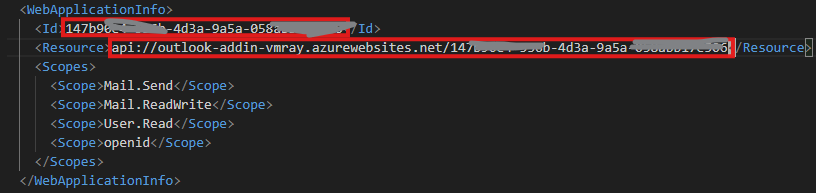

#### Optional: Customize Display Text
1. You may optionally update the values inside the following elements to match your organization’s terminology:

* `<DisplayName>`
* `<Description>`
* `GroupLabel`
* `TaskpaneButton.Label`
* `TaskpaneButton.Tooltip`
2. You can replace them with your internal security team name or preferred branding.
3. Save the file.


## Step 3 – Update `fallbackauthdialog.js`

* Open `src/helpers/fallbackauthdialog.js`

* Update the following values with your production details.


    > | Variable      | Value                                       |
    > | ------------- | ------------------------------------------- |
    > | `clientId`    | Application (client) ID                     |
    > | `accessScope` | Scope value saved in **Expose an API** step |
    > | `authority`   | Replace `{tenantId}` with Tenant ID value   |
    > | `redirectUri` | Replace with fallback Redirect URI  saved in **Configure Authentication** step        |


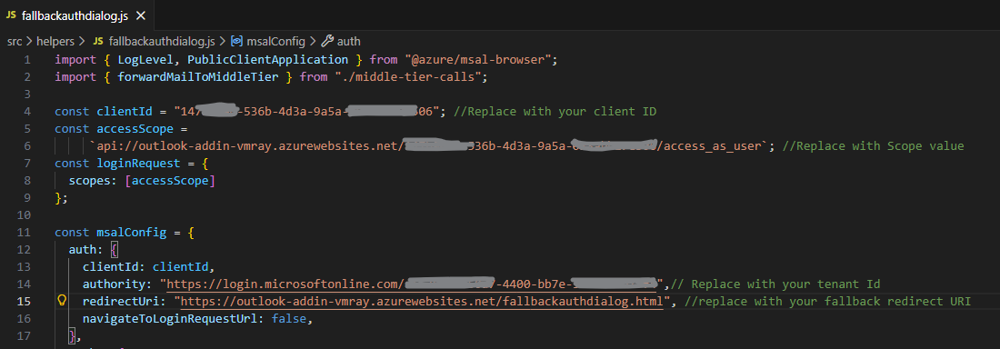


## Step 4 – Security Mail Configuration

In `config.js`, update the following values before deployment:

```js
SECURITY: {
  RECIPIENT: "###########@us.ir-mailbox.vmray.com",
  ALLOWED_RECIPIENT_BASE_DOMAIN: "ir-mailbox.vmray.com",
},
```

For security reasons:

* The domain of `RECIPIENT` **must match** `ALLOWED_RECIPIENT_BASE_DOMAIN` or its subdomains.
* This prevents accidental or malicious forwarding to unauthorized domains

In addition to the required security settings, other values inside CONFIG (such as email subject, folder name, retry behavior, and UI messages) are customizable.

---

# Phase 6 – Build and Deploy to Azure App Service

After completing all add-in file changes, deploy the add-in to Azure App Service.

### Step 1 – Build the Project

* In **VS Code**, open your project folder and go to terminal and run:
    ```
    npm install
    npm run build
    ```

This installs all required packages and generates the `dist` folder, which contains the production-ready files.


### Step 2 – Deploy to Azure App Service

1. In **VS Code Explorer**, locate the `dist` folder.
2. Right-click the `dist` folder.
3. Select **Deploy to Web App…**

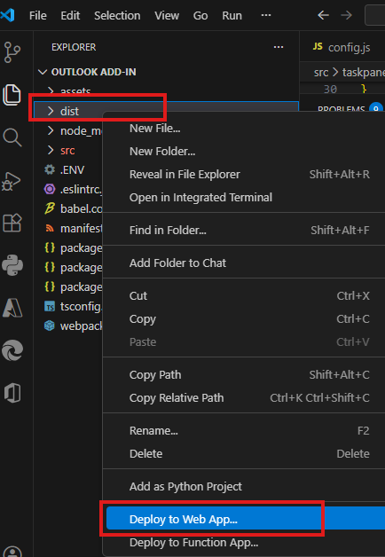

4. Choose the subscription and next **Azure App Service** created earlier.
5. When prompted, confirm by selecting **Deploy**.


6. If asked to always deploy the workspace, select **Yes**.


7. Wait until deployment completes successfully.

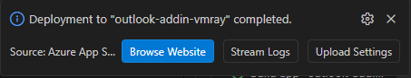


####  Redeploy After Changes

If you make any code changes:

1. Run `npm run build` again.
2. Redeploy the `dist` folder to the same Web App.

---


## Phase 7 – Deploy the Add-in via Microsoft 365 Admin Center

After the web application is deployed successfully, deploy the Outlook Add-in manifest to Microsoft 365.

### Step 1 – Sign in

1. Go to the **Microsoft 365 Admin Center**
   [https://admin.microsoft.com](https://admin.microsoft.com)
2. Sign in with a **Global Administrator** oaccount.


### Step 2 – Navigate to Integrated Apps

1. From the left navigation menu, select: **Settings → Integrated apps**


2. Select the **Add-ins** tab at the top.

3. Click **Deploy Add-in**.


### Step 3 – Upload the Manifest

1. In the **Deploy a new add-in** wizard, click **Next**.

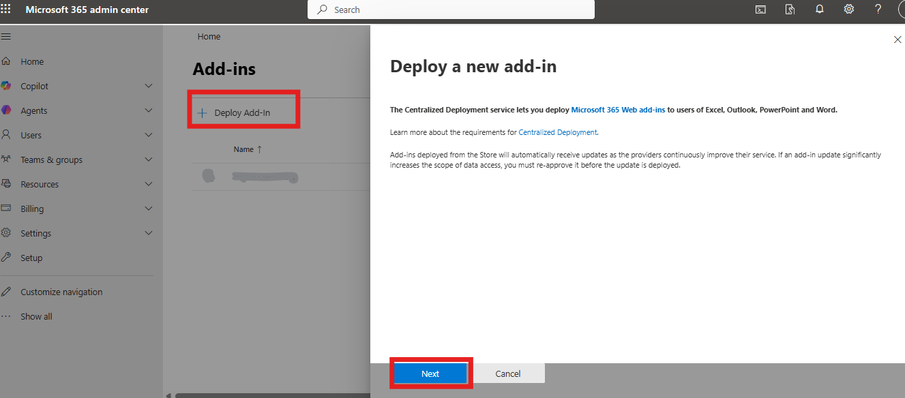

2. Choose:

   > ✅ **Upload custom apps**

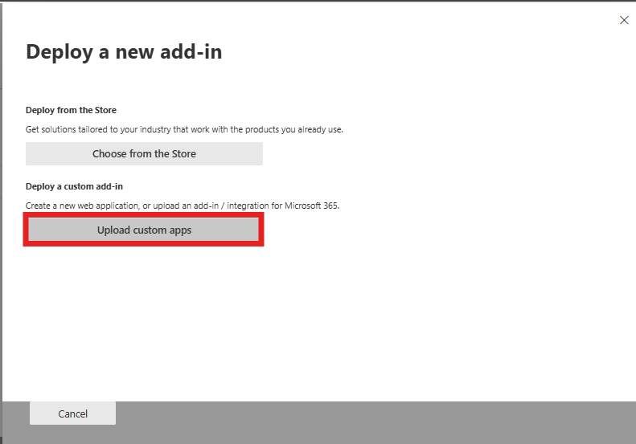

3. Click **Choose File**.

4. Browse to your project and select:

   ```
   manifest.xml
   ```
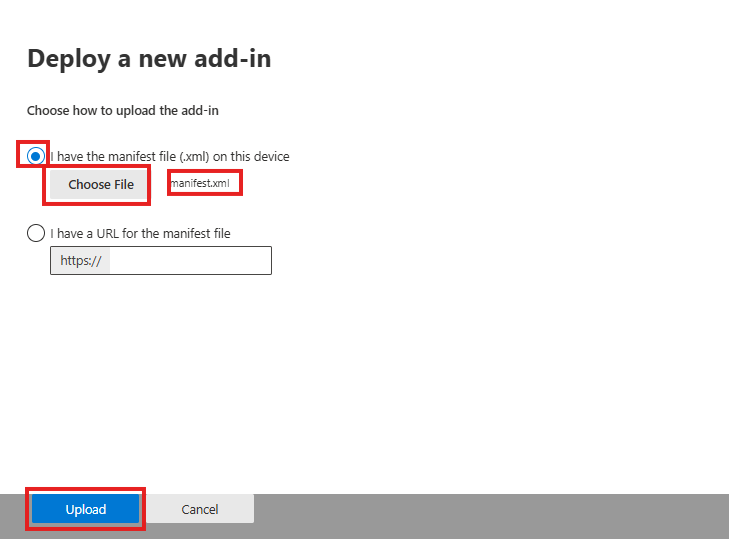

5. Click **Upload**.

### Step 4 – Assign Users

Choose who should receive the add-in:

* **Everyone** – Deploys the add-in to all users in the organization (use only if required).
* **Specific users/groups** – Deploys to selected users or groups; group-based assignment automatically updates when members are added or removed.
* **Just me** – Deploys only to your account; recommended for initial testing before organization-wide rollout.

* Click **Deploy** to complete the assignment.

* Click **Deploy**.

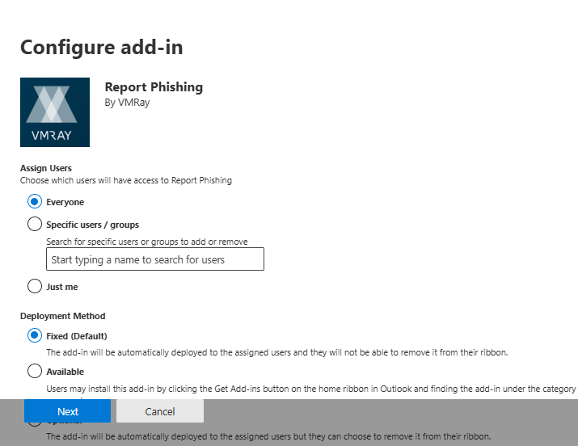

### Step 5 – Confirmation
* Confirmation of the admin Consent by clicking on save.

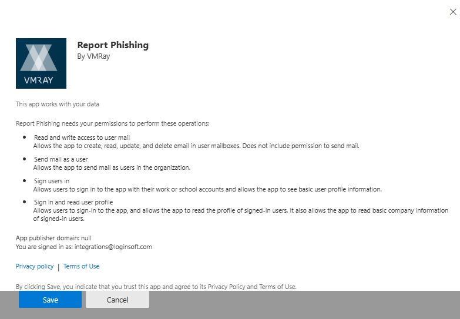

* A green checkmark appears when deployment succeeds.


* Click **Next** to finish.

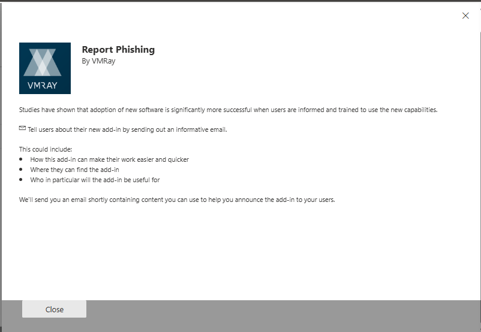

* If you deployed only to yourself and later want broader rollout:

 > Return to Integrated Apps → Select the add-in → Change user assignment.


### Step 6 – Propagation Time

Deployment may take:

* 5–15 minutes (sometimes up to 24 hours)

Users may need to:

* Restart Outlook
* Refresh Outlook on the Web


